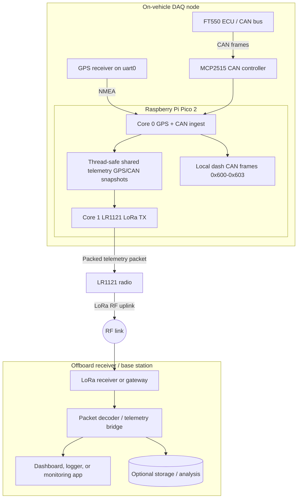

# System Architecture

The firmware is organized around two cooperative cores on the Raspberry Pi Pico 2, with an external LoRa receiver/base-station path on the other side of the air link.

## Comprehensive system view

## Core responsibilities

### Core 0

Core 0 performs the continuous input side of the system:

- reads GPS NMEA data from `uart0`
- decodes and filters GPS sentences
- receives CAN traffic through the MCP2515
- assembles dashboard CAN frames for the local dash bus

### Core 1

Core 1 is dedicated to wireless uplink:

- initializes the LR1121 radio
- builds a packed telemetry payload
- transmits the payload over LoRa at a fixed interval

## Shared data model

Telemetry is copied between cores using thread-safe helper functions and spin locks.
This keeps GPS and CAN state coherent while the LoRa sender runs independently.

## Main data path

1. GPS UART feeds `gps_process()`.
2. MCP2515 frames feed `can_process_frame()`.
3. `FS26-DAQ.c` combines the latest GPS and CAN snapshots into a packed LoRa payload.
4. `lora_send()` transmits the payload and tracks the TX count.
5. The offboard receiver picks up the radio packet, decodes it, and forwards it to a dashboard, logger, or analysis tool.

## Support libraries

- `src/gpio/` and `src/spi/` provide hardware abstraction for the LR1121 stack.
- `src/lr1121/` contains the Semtech-derived radio driver and board integration code.
- `src/mcp2515/` provides MCP2515 CAN controller support.
